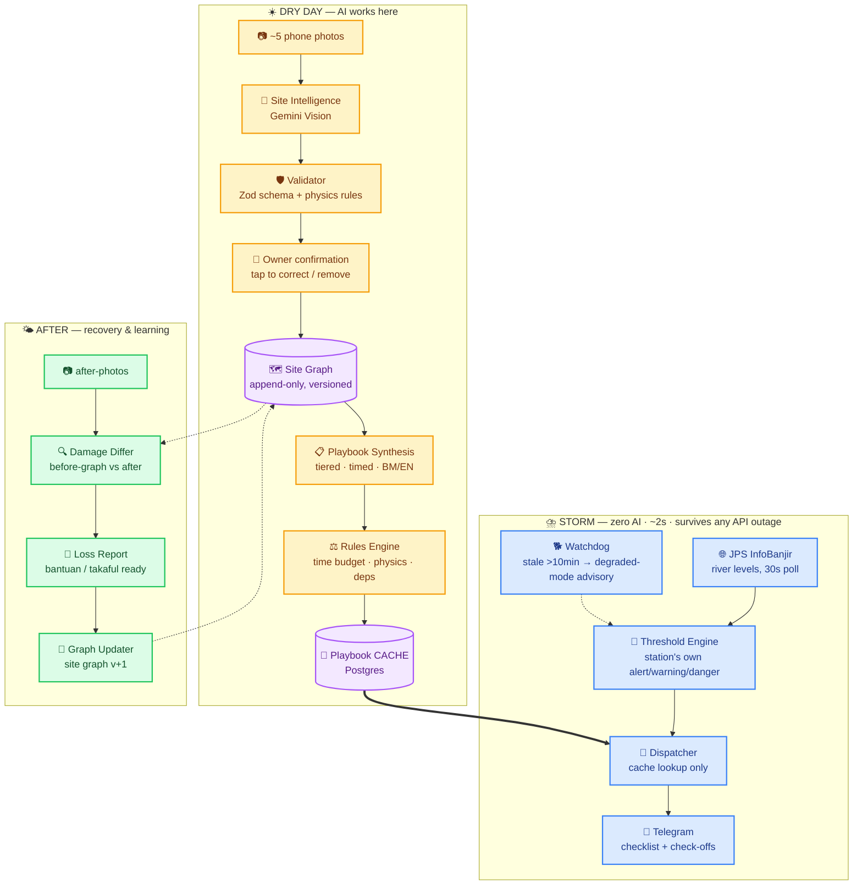
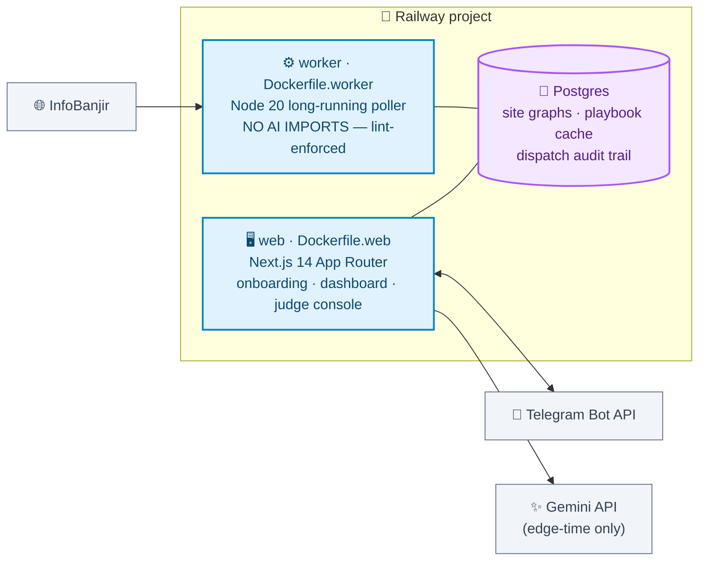

<div align="center">

# 🌊 BanjirKawan

### *Setiap amaran banjir menjadi pelan tindakan kedai anda.*

**We keep your kedai alive before the banjir — and get you paid after.**

<br/>

[](https://nextjs.org)
[](https://www.typescriptlang.org)
[](https://www.postgresql.org)
[](https://railway.app)
[](https://ai.google.dev)
[](https://core.telegram.org/bots)

[](./tests)
[](./docker-compose.yml)
[](https://publicinfobanjir.water.gov.my)
[]()

</div>

---

## 💡 The idea in one breath

Malaysia has world-class flood telemetry — **~200 real-time river stations** with published alert/warning/danger thresholds (JPS InfoBanjir). What it doesn't have is the **last metre**: turning *"Sungai Klang at WARNING"* into ***your* shop, *your* freezer, *your* next 3 hours.**

BanjirKawan onboards a small business with **~5 phone photos**. AI vision builds a structured **site risk graph** — every asset, its height off the floor, its value. AI then pre-computes a **tiered, timed action playbook** per official river threshold — validated and **cached**. When a station crosses its threshold, a deterministic trigger sends the cached playbook via **Telegram** in Bahasa Melayu. After the flood, the same site graph becomes the **evidence baseline** for bantuan banjir aid and takaful claims.

> ### ⚡ The engineering thesis
> **AI is never in the critical path.** It thinks on dry days — surveying, planning, caching.
> During the storm, the alert path is dumb, deterministic, offline-tolerant code:
> **threshold → cache lookup → send.**
> The resilience tool is itself resilient to the climate event. *(Enforced by ESLint: any AI import inside `src/worker/` or `src/modules/trigger/` fails the build.)*

📐 **Deep dives:** [Systems-thinking analysis](./docs/systems-thinking.md) (Iceberg, causal loops, the Seven Maxims, three scenarios, Five Marks, Climate-U map) · [100-point rubric self-audit](./docs/rubric-map.md) · [Money & funding notes](./docs/pitch-notes.md) · [Championship pitch bible](./docs/pitch-script.md)

---

## 🏗️ Architecture



### 🚢 Deployment topology



---

## ✨ What's working today

| | Feature | Status |
|---|---|---|
| 🧠 | **AI site survey** — photos → structured asset inventory (heights, values RM, movability) with per-asset confidence | ✅ live |
| 🛡️ | **Three-layer hallucination defence** — confidence flags → owner confirm screen → Zod + physics validator (reject → regenerate once) | ✅ live |
| 🌐 | **InfoBanjir ingestion** — real station levels + published thresholds, parser tested against a saved live response | ✅ live |
| 📏 | **Threshold engine** — classifies every station against *its own* published thresholds, detects tier changes | ✅ live |
| 🐕 | **Staleness watchdog** — fresh / stale / dead feed states, fails loud and safe | ✅ live |
| 📱 | **Telegram bot** — webhook with secret validation, `/start` binding, echo | ✅ live |
| 🎛️ | **Judge console** — `SIMULATE FLOOD` button firing the real pipeline, no live-data dependency | ✅ live |
| 📍 | **Auto station-linking** — address → geocode (Nominatim) → nearest river station, offline via DID grid-encoded station ids | ✅ live |
| 📋 | **Playbook engine** — prioritizer (value × vulnerability ÷ time) → Gemini synthesis in BM/EN → deterministic rules engine (time budgets, physics, electrical-last) → validated cache | ✅ live |
| 🔁 | **AI resilience** — model fallback chain across independent free-tier quotas, request pacing, provider retry-hints honoured | ✅ live |
| 🌐 | **Trilingual UI** — BM / EN / 中文, one language at a time, typed dictionaries with key-parity tests | ✅ live |
| 🎨 | **Production UI** — nav tabs, light/dark mode (no-flash init), skeleton loading, guided empty states, actionable error states | ✅ live |
| 🚀 | **Dispatcher** — threshold escalation → flood event → cached playbook → Telegram checklist with tap-to-check-off, full audit trail (queued/sent/failed/dead) | ✅ live |
| 📍 | **GPS onboarding** — one-tap device location beats typed addresses; reverse-geocoded, station pinpointed from coordinates | ✅ live |
| 🇲🇾 | **Whole-Malaysia monitoring** — all 16 InfoBanjir states, parallel fetch, 48h readings retention | ✅ live |
| 🔎 | **Readings explorer** — filter by state/level, search by station name/ID, postcode→nearest or GPS→nearest with distance, paginated across every station | ✅ live |
| 🗺️ | **Live danger map** — every station plotted and colour-coded by threshold (Leaflet), GPS "near me" with nearest-station line, tap-for-detail; dark-mode aware | ✅ live |
| 🧾 | **Recovery mode** — after-photos → validated damage diff → printable bantuan/takaful loss report with JPS telemetry as third-party evidence → site graph v+1 learning loop | ✅ live |

---

## 📊 Measured impact — from the audit trail, not a spreadsheet

Every dispatch, check-off tap and loss report writes telemetry. The metrics engine (`src/modules/metrics`, 14 golden-fixture tests) derives, per flood event and overall:

| Metric | Demo value (seeded kedai) |
|---|---|
| **RM protected** (checked-off actions, honest ranges) | RM 10,600–22,200 |
| **Warning lead time** (first send → station hits DANGER) | 3h 12m |
| **Detect → send latency** | 2.1s |
| **Checklist completion** (behavioural telemetry) | 83% (5/6), first action in 90s |
| **Claim report turnaround** (photos → signed report) | minutes, vs. weeks manually |

`npm run seed:demo` loads a realistic 12-asset kedai + one completed flood event so the dashboard shows non-zero numbers with no live data and no AI calls.

---

## 🚀 Quick start

```bash
# 1 · Environment
cp .env.example .env               # defaults work with the compose postgres

# 2 · Database
docker compose up -d postgres
npm install
npm run migrate

# 3 · Run (two terminals)
npm run dev                        # web  → http://localhost:3000
npm run worker:dev                 # poller — real Selangor river levels within ~30s

# …or everything in Docker
docker compose up --build
```

| Page | What you'll see |
|---|---|
| `http://localhost:3000` | Live river levels + worker heartbeat |
| `http://localhost:3000/onboard` | 📷 The AI site survey wizard |
| `http://localhost:3000/demo` | 🌊 SIMULATE FLOOD judge console |

### 🧪 Tests & the load-bearing lint rule

```bash
npm run test    # 26 unit tests — parser (real fixture) · thresholds · watchdog · validator
npm run lint    # fails if ANY AI import enters src/worker or src/modules/trigger
```

---

## ⚙️ Configuration

All variables documented in [`.env.example`](./.env.example).

| Variable | Required | Purpose |
|---|:---:|---|
| `DATABASE_URL` | ✅ | Postgres (Railway plugin / compose maps host port **5433** locally) |
| `GEMINI_API_KEY` | for onboarding | Google AI Studio key (free tier) |
| `GEMINI_MODEL` | — | default `gemini-3.5-flash` |
| `TELEGRAM_BOT_TOKEN` / `TELEGRAM_WEBHOOK_SECRET` | for alerts | [@BotFather](https://t.me/BotFather) bot + any random secret |
| `INFOBANJIR_STATE_CODES` | — | default `SEL,WLH` |
| `POLL_INTERVAL_SECONDS` | — | default `30` |

## ☁️ Deploy — Railway

One project, three services:

1. **🐘 Postgres** — add the database plugin (exposes `DATABASE_URL`).
2. **🖥️ web** — new service from this repo, Dockerfile path `Dockerfile.web`, variable `DATABASE_URL = ${{Postgres.DATABASE_URL}}` + the Telegram/Gemini vars, public domain on port 3000.
3. **⚙️ worker** — same repo, Dockerfile path `Dockerfile.worker`, `DATABASE_URL = ${{Postgres.DATABASE_URL}}`.

```bash
# migrations, from your machine
DATABASE_URL="<railway postgres url>" npm run migrate

# telegram webhook, once the web domain exists
curl "https://api.telegram.org/bot<TOKEN>/setWebhook" \
  -d "url=https://<your-app>.up.railway.app/api/telegram" \
  -d "secret_token=<TELEGRAM_WEBHOOK_SECRET>"
```

---

## 📁 Repository layout

```
src/
├── modules/                ← framework-free domain core
│   ├── trigger/            ⛈️  STORM-TIME CRITICAL PATH — zero AI, ESLint-enforced
│   ├── site-intelligence/  🧠 photos → validated SiteGraph
│   ├── playbook/           📋 SiteGraph → tiered timed plans     (Day 4)
│   ├── delivery/           📱 Telegram channel (SMS-ready interface)
│   ├── recovery/           🧾 damage diff → loss report          (Day 6)
│   ├── learning/           🔁 outcomes → site graph v+1          (Day 6+)
│   └── geo/                📍 geocode + nearest station          (Day 3)
├── lib/
│   ├── ai/                 ✨ Gemini wrapper + versioned prompts
│   └── db/repositories/    🐘 ALL SQL lives here
├── worker/                 ⚙️ poll → classify → detect → heartbeat
└── app/                    🖥️ Next.js delivery layer (thin)
db/migrations/              versioned SQL, applied by npm run migrate
tests/                      unit tests on pure logic + real saved fixtures
```

**Dependency rule** (ESLint-enforced): `app & worker → modules → lib` — modules never import the delivery layer, and the trigger module can never import AI.

---

## 🗺️ Nine-day build plan

- [x] **D1** — scaffold · Docker · migrations · InfoBanjir parser · Telegram echo · worker
- [x] **D2** — vision pipeline: photos → SiteGraph → validator → confirm screen
- [x] **D3** — enrichment: geocode + nearest station (offline DID grid decoding)
- [x] **D4** — playbook synthesis (BM/EN) + rules engine + cache · golden fixtures
- [x] **D5** — dispatcher + Telegram checklists + SIMULATE FLOOD wiring → *minimum pitchable product* ✨
- [x] **D6** — recovery mode: after-photo walkthrough · damage differ · printable claim report · learning loop
- [x] **D7** — impact metrics engine + dashboard · seed script · SMS/print fallbacks
- [ ] **D8** — 🧊 FREEZE · pitch assets · rehearsal
- [ ] **D9** — 🎤 pitch day

<div align="center">
<br/>

**Built solo in 9 days for the Climate Resilience Hackathon 2026** 🇲🇾

*"Every flood warning becomes your shop's personal survival plan —*
*and every survival plan becomes your claim evidence."*

</div>
