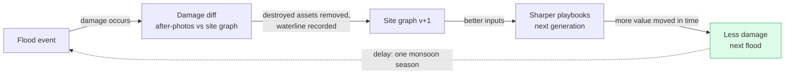
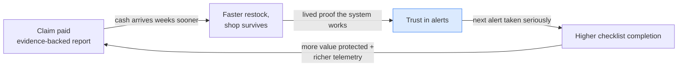

# BanjirKawan — Systems Thinking Analysis

This document applies the systems-thinking toolkit (Iceberg Model, causal loop
diagrams, the Seven Maxims, the Five Marks of a system that holds) to the
problem BanjirKawan attacks and to BanjirKawan itself. Everything referenced
here exists in the codebase — file paths are given so claims can be checked.

---

## 1 · The Iceberg Model

### Diagnosis — why do shop losses repeat every monsoon?

| Level | What we see |
|---|---|
| **Event** | A kedai in Taman Sri Muda floods overnight. The freezer is dead, the rice is mud, the till is gone. RM30–80k lost in one night. |
| **Pattern** | The *same* shops flood every monsoon. Warnings were issued every time — December 2021 (~RM6.1B national losses), 2022, 2023… Losses repeat even though the water was announced hours in advance. |
| **Systemic structure** | Three structural facts produce the pattern: (1) warnings are **river-centric, not shop-centric** — "Sungai Klang at WARNING" says nothing about *your* freezer and *your* 3 hours; (2) there is **no pre-loss evidence baseline**, so aid and takaful claims stall or fail after the water recedes; (3) the knowledge of what to save first lives **only in the owner's head**, under adrenaline, at 3am. |
| **Mental model** | *"Banjir is fate. You mop, you restock, you carry on."* Preparation feels pointless because warnings never translated into doable actions, and claims feel pointless because there was never proof. |

### Solutioning — what BanjirKawan changes at each level

| Level | Intervention |
|---|---|
| **Event** | Telegram checklist arrives the moment the station crosses its threshold: ranked, timed, in the owner's language (`src/modules/trigger/dispatcher.ts`). |
| **Pattern** | Check-off telemetry + the learning loop (`src/modules/learning`) make each flood improve the next response: site graph v+1, waterline recorded as a planning input. The pattern of repeated identical losses is broken by making the system *learn*. |
| **Systemic structure** | New structures: a **shop-level site graph** (the missing translation layer between river telemetry and a specific shop), a **pre-computed validated playbook cache**, and a **claims-grade evidence baseline** (before-survey + station telemetry + after-photos → `/report/[id]`). |
| **Mental model** | The one we aim to install: *"A warning is my 3-hour action window, and my loss is claimable."* The RM-values on every checklist line and the printable claim report are the levers that shift the belief. |

The deepest lever is the mental model — which is why every checklist action
shows the ringgit it protects, and why the loss report exists at all. Money
made visible is what converts "fate" into "window".

---

## 2 · Causal loop diagrams

### Loop A — Balancing loop with a delay (the learning loop)

**Balancing:** each pass reduces the damage the next flood can do.
**The delay matters:** the loop only closes when the *next* flood arrives — one
monsoon season later. Systems with delayed feedback invite abandonment ("we
did all that and nothing happened"). Mitigation: the metrics panel surfaces
value-protected figures **immediately** after every event (even simulated
ones), so the feedback the owner *feels* is minutes, not seasons.

### Loop B — Reinforcing loop (the trust engine)

**Reinforcing:** every successful claim makes the *next* alert more effective.
This is also the adoption flywheel: completion telemetry (real behavioural
data from `dispatch_checkoffs`) is what convinces insurers/agencies to
subsidise the tool, which widens the loop.
**Runaway risk (honesty):** reinforcing loops also run downward — one false
alarm erodes trust, lowering completion, weakening evidence. This is why
alerts fire only on the station's *own published thresholds* (never our
guesses) and why tiers exist rather than a single cry-wolf alarm.

---

## 3 · The Seven Maxims, applied

| # | Maxim | Where BanjirKawan answers it |
|---|---|---|
| 1 | **Every action has side effects** | The obvious build — "AI reads the river and tells shops what to do" — has a catastrophic side effect: AI dependence *during* the disaster. Our structure removes it: AI thinks on dry days; the storm path is `threshold → cache lookup → send` with zero AI imports. |
| 2 | **The cure can be worse than the disease** | A resilience tool that fails in the event it exists for is worse than no tool (false security). Hence: cached playbooks (no generation at alert time), watchdog advisories when the feed dies (`src/worker/main.ts`), SMS renderer + printable plan when data networks degrade. The tool's own failure modes were designed first. |
| 3 | **Structures drive behaviour** | We don't *trust ourselves* to keep AI out of the critical path — the ESLint `no-restricted-imports` rule makes the build fail if anyone tries (`.eslintrc.json`). Discipline enforced by structure, not memory. Same idea user-side: the checklist's RM-per-action ordering *structures* the owner's 3am panic into highest-value-first behaviour. |
| 4 | **The easy way out leads back in** | The easy build (push raw JPS warnings to a Telegram channel) reproduces the existing failure: generic warnings nobody can act on. We deliberately took the hard path — per-shop translation. |
| 5 | **Behaviour grows better before it grows worse** | A shop that "survived fine" through two small floods grows complacent for the big one. The tiered system counters this: WATCH-level activations keep the practice muscle alive at low cost, so the DANGER activation isn't the first rehearsal. |
| 6 | **Delays make systems oscillate** | Two delays are designed around: (a) the feed can lag or die mid-storm — the watchdog detects staleness within 10 minutes and switches users to precaution mode rather than silence; (b) the learning loop's one-season delay — bridged by immediate metrics (see Loop A). |
| 7 | **You are not the centre of the system** | BanjirKawan adds no new sensor, no new warning authority — it bolts onto JPS telemetry, Telegram, and the existing aid/takaful institutions. The system treats itself as the *last metre* of an existing chain, not a replacement for it. Equity note: continuity planning used to be a consultant product for corporates; a photo survey prices it at a kedai's budget. |

**Honest self-critique (side effects we created and mitigate):**

- *Alert fatigue* — new risk introduced by us. Mitigated by tiering on official
  thresholds and per-station change detection (alerts on transitions, not
  levels). Residual risk acknowledged.
- *Digital exclusion* — a Telegram-first tool excludes non-smartphone owners.
  Mitigated (not solved) by the printable plan and the SMS-format channel;
  a fully offline onboarding path would need a field partner (see pitch notes).
- *Automation complacency* — "the app will tell me" can dull self-reliance.
  The printable plan and the WATCH-tier practice runs push knowledge back
  into the shop, not just the phone.

---

## 4 · "What if?" — designed for the worst day, not the average

### 4a · The three canonical scenarios (NGFS / IPCC, per Session 1)

The webinar teaches three standard futures — you don't invent them, you test
against them. BanjirKawan's value under each:

| Scenario | The world… | What it means for BanjirKawan |
|---|---|---|
| **Fast & smooth** | acts early; cleaner quickly, less damage | Fewer extreme floods, but the tool still delivers the *recovery + claims* half and keeps the practice muscle alive at WATCH tier. Value degrades gracefully — we're not betting on catastrophe. |
| **Slow then sudden** | acts late; panic changes, expensive and messy | **Our sweet spot.** More frequent, more intense floods with underprepared shops — exactly the population BanjirKawan protects, at ≈RM0 marginal cost per event. |
| **Barely acts** | does little; much worse weather | Flood frequency and severity climb steeply. Because plans are pre-cached and the storm path has no AI/cost dependency, the system *scales with the climate signal* instead of buckling under it. |

The design is robust across all three — strongest exactly where the risk is
worst. That is what "design for the worst day, not the average" means in
practice.

### 4b · Adversarial stress table (the surprise "what if?" the judges throw)

| Scenario | What happens | Where it's implemented |
|---|---|---|
| **Floods double in frequency by 2030** | Marginal cost per additional flood ≈ RM0: playbooks are pre-computed and cached; dispatch is a DB lookup + one API call. | `playbooks` cache table; `dispatcher.ts` |
| **InfoBanjir dies mid-storm** | Watchdog flags stale ≥10min / dead ≥1h; bound shops get a "treat heavy rain as WARNING" advisory instead of silence. Fails loud and safe. | `watchdog.ts`, `sendDegradedAdvisories` in `worker/main.ts` |
| **Gemini / all AI APIs die during the flood** | Nothing happens. AI is not in the storm path — the lint rule makes this a build-time guarantee, not a hope. | `.eslintrc.json` (`no-restricted-imports`) |
| **Owner's phone is dead / no data network** | The WATCH tier fired hours earlier ("act now while networks are up"); the laminated plan on the wall carries the DANGER checklist and the station's official levels. | `format.ts` early-tier note; `/plan/[shopId]` |
| **Telegram specifically is blocked/down** | Dispatch status machine records failures (`queued→failed→dead`, retries with backoff); SMS renderer stands ready behind the same channel interface — a gateway driver is a config swap. | `dispatcher.ts`, `sms.ts`, `channel.interface.ts` |
| **The database dies** | Web UI degrades to guided error states with fix instructions; the worker keeps polling and logs; nothing corrupts (append-only writes). | status page error states; append-only tables |
| **Combined worst day** (feed stale + no data + power cut) | The system's value was front-loaded: survey done on a dry day, playbook cached, WATCH checklist delivered early, paper plan on the wall. The storm-time system can lose *every* network dependency and the owner still has the plan. | the whole dry-day/storm split |

The pattern across every row: **move the thinking to before the disaster.**

---

## 5 · Five Marks of a system that holds

| Mark | Self-assessment | Evidence |
|---|---|---|
| **Strong** | The critical path is short, deterministic, tested: threshold classifier and dispatcher covered by unit tests; parser tested against a saved *real* InfoBanjir response; 95 tests, boundary lint. | `tests/unit/*`, `.eslintrc.json` |
| **Backups** | Cached playbooks (no live generation), AI model fallback chain across independent quotas for dry-day work, dispatch retry/backoff with a dead-letter state, append-only versioned data. | `playbooks` cache, `ai/client.ts`, `dispatcher.ts` |
| **Variety** | Three delivery modes of the same plan: Telegram (rich, interactive), SMS format (degraded networks), paper (no tech at all). Three languages. Two onboarding paths (GPS or address). | `format.ts`, `sms.ts`, `/plan`, i18n |
| **Flexible** | Modular monolith with enforced boundaries — any module extracts to a service without rewrites; channel interface accepts new transports; per-station thresholds mean new stations/states are config, not code. | `src/modules/*`, `channel.interface.ts` |
| **Bounces back** | Recovery is a first-class mode, not an afterthought: damage diff → claims-grade report in minutes (vs weeks) → learning loop makes the *next* response sharper. The system doesn't just survive the flood; it comes back knowing more. | `src/modules/recovery`, `src/modules/learning`, `/report/[id]` |

---

## 6 · Climate-U alignment (Session 3 — prize framing)

The Climate Systems Leadership Award rewards the Climate-U ethos, not just the
rubric. BanjirKawan touches each core value — honestly, without overclaiming:

| Climate-U value | How BanjirKawan expresses it |
|---|---|
| **Collaboration / co-creation** | The onboarding survey is *participatory*: AI proposes, the shop owner confirms and corrects every asset and value. Knowledge is co-created with the community it serves, not imposed on it. |
| **Interdisciplinarity** | Hydrology (JPS thresholds) + computer vision + geospatial (station-grid decoding) + behavioural design (check-off telemetry) + insurance/finance (claims evidence) in one tool. |
| **Community engagement** | The unit of the system is the individual kedai owner; the output is in their language, on the channel they already use, at their budget. |
| **Evidence-based action** | Every alert is grounded in the station's *own published thresholds*; every loss figure traces to a confirmed pre-flood survey + independent JPS telemetry. Nothing is asserted without a checkable source. |
| **Sustainability / long-term impact** | The learning loop compounds: each flood sharpens the next response. Resilience infrastructure that improves with use, not a one-off. |
| **Inclusivity** | Three languages, three delivery channels (Telegram / SMS / paper), two onboarding paths (GPS / typed), and a funding model designed to subsidise the least able to pay. |

**Participatory Action Research (PAR):** the pilot design — 20 shops on one
Taman Sri Muda street, one monsoon season, measured against the neighbouring
street — is a PAR study in miniature: reflection and action combined, with the
affected community as co-researchers, not subjects.

---

## 7 · One-line summary for the pitch

> We didn't add AI to a flood alert. We mapped why losses repeat — river-centric
> warnings, no evidence, knowledge trapped in heads — and built new structure at
> each level of the iceberg, with the discipline enforced by lint rules instead
> of good intentions. The proof is that you can kill every AI API, the data
> feed, and the owner's phone on the worst day, and the plan still executes.
